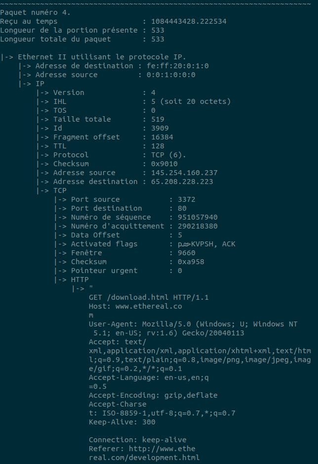

# Packet-Analyzer
Packet capturer that analyzes both live (i.e. incoming) and offline (i.e. pcap file) captures and prints the packet's contents.

In order to run this program the pcap library must be installed.
In order to do so on Ubuntu, the following command is required: `sudo apt-get install libpcap-dev`.

Running `bin/program --help` details the options, but a first test that can be executed is to run 

`make`

`bin/program -o test/http.cap`

## Example

Example output for HTTP file.

All of the fields from the packets are described hierarchichally.

Outputs are in French per school requirements.
